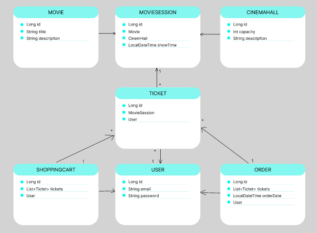

#  🎬 The cinema app

### 👉 Description

In this application you can be identified as a user, work and logout 🤓👌
The user has his own shopping cart with orders, in the orders there are tickets 
and detailed information about the film, the cinema hall and at a particular time there will be a session.

### 👉 Project structure
 - DAO - database communication layer
 - Service - business logic implementation level
 - Controller - the level of receiving a request and giving a response
### 👉Features
- Registration
- Login / Logout
- ADMIN can create and delete movies and movie sessions
- USER can buy a ticket for the movie session 
- Access configuration by HTTP methods and Role
 ` POST: /register - all
  GET: /cinema-halls - user/admin
  POST: /cinema-halls - admin`
### 👉 Technologies
- Java 11
- Maven
- MySQL
- Tomcat
- Hibernate
- Spring Web/Security
### 👉 Quickstart
  - Fork this repository
  - Copy link of project
  - Create new project from Version Control
  - Edit resources/db.properties with your parameters

  `db.driver=YOUR_DRIVER
  db.url=YOUR_URL
  db.user=YOUR_USERNAME
  db.password=YOUR_PASSWORD`

  - Install Tomcat and configure in project
  - Run project

